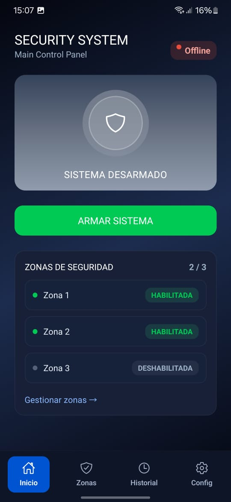
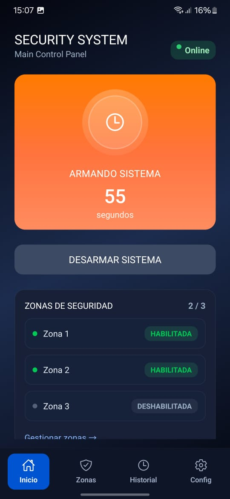
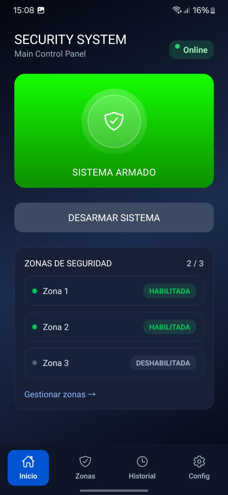
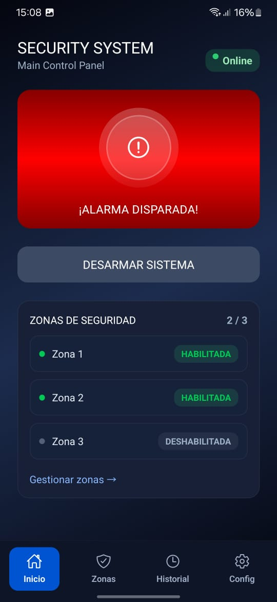
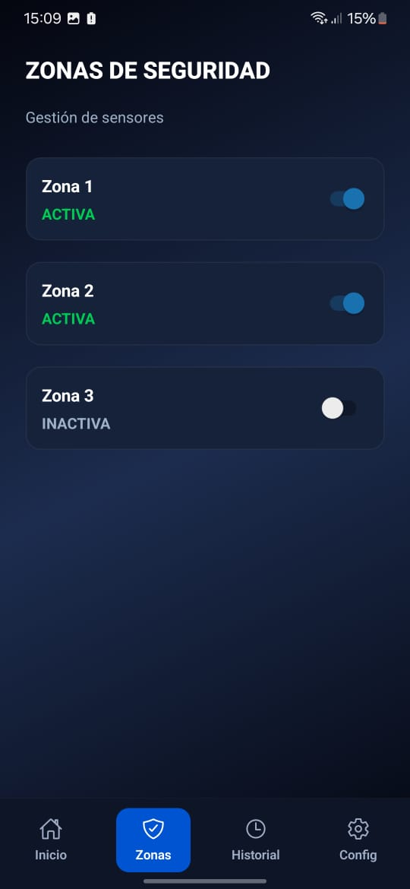
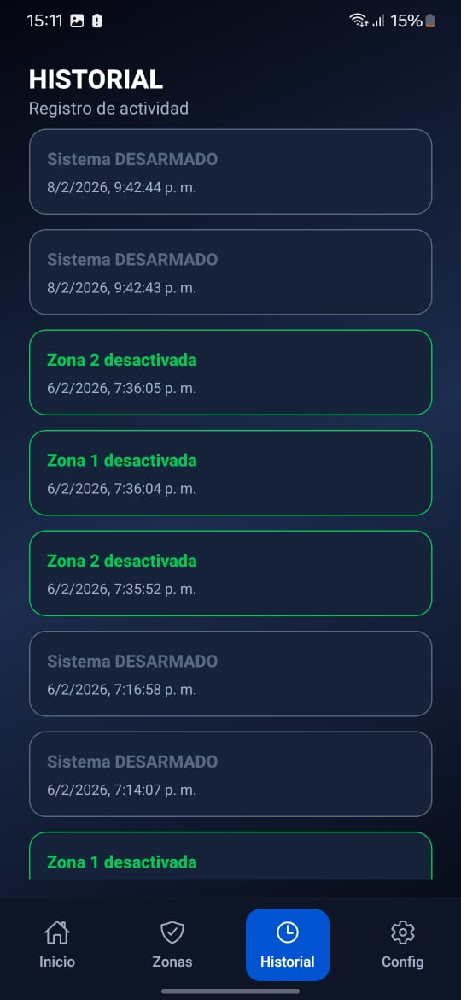
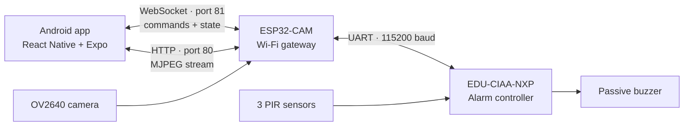

# G12 Smart Alarm System

An Android application and IoT platform for monitoring and controlling a physical, three-zone alarm system with live video and real-time status updates.

This academic project was developed for **Project Workshop I — Computer Engineering, National University of La Plata (UNLP)**. It combines an EDU-CIAA-NXP board, an ESP32-CAM, and PIR motion sensors. This repository is structured as a portfolio presentation, with a particular focus on the mobile application and end-to-end integration.

## Android app demo

<table>
  <tr>
    <td align="center"><br><sub>Disarmed</sub></td>
    <td align="center"><br><sub>Arming countdown</sub></td>
    <td align="center"><br><sub>Armed</sub></td>
  </tr>
  <tr>
    <td align="center"><br><sub>Alarm triggered</sub></td>
    <td align="center"><br><sub>Zone management</sub></td>
    <td align="center"><br><sub>Event history</sub></td>
  </tr>
</table>

[View the complete recorded demonstrations](docs/DEMOS.md), including connection setup, the main control panel, zone management, event history, and the integrated hardware prototype.

## Android application

The Android application is the main user-facing component of the project. It replaces a traditional alarm keypad with a mobile control panel that brings together system control, live monitoring, configuration, and event review. The interface was designed to provide immediate visual feedback while keeping the embedded controller as the authoritative source of the alarm state.

The application is organized into four primary screens:

| Screen | Purpose |
| --- | --- |
| **Main panel** | Displays the current alarm state, hardware connection, enabled zones, and live sensor activity. It also provides the controls for arming and disarming the system. |
| **Zones** | Enables or disables each of the three protection zones, assigns custom names, and opens the ESP32-CAM live video stream. |
| **History** | Presents timestamped arming, disarming, and alarm-trigger events received from the embedded system. |
| **Configuration** | Stores the ESP32-CAM IP address, WebSocket port, and automatic reconnection preference. |

Built with React Native, Expo Router, and TypeScript, the app uses reusable components and tab-based navigation. Its communication and state-management layer is centralized in `store/alarm.tsx`, which manages the WebSocket lifecycle, command delivery, hardware messages, reconnection, zone state, and event history. AsyncStorage preserves connection settings and custom zone names between sessions.

Commands are sent to the ESP32-CAM over WebSocket, but visible alarm-state changes are applied only after confirmation arrives from the EDU-CIAA. This avoids showing an action as successful before the physical controller has processed it. The camera view uses an embedded WebView to display the MJPEG stream served directly by the ESP32-CAM.

The complete mobile source is available in [`android-app/`](android-app/), with additional implementation details in the [Android application README](android-app/README.md).

## Features

- Remote system arming and disarming.
- Reactive state: the UI only displays changes confirmed by the hardware.
- Independent enable/disable controls and custom names for three zones.
- Per-zone motion indicators and online/offline connection status.
- Automatic WebSocket reconnection with backoff and heartbeat monitoring.
- Timestamped arming, disarming, and alarm event history.
- Live MJPEG video from the ESP32-CAM.
- Local persistence for the IP address, port, reconnection preference, and zone names.

## Architecture



The **EDU-CIAA** is the source of truth for the alarm state. The **ESP32-CAM** bridges UART and the local network, stores an in-memory circular event history, and serves the camera stream. The **Android app** provides the user experience and waits for hardware confirmation before updating its state.

The UART protocol retains its original Spanish state identifiers for firmware compatibility:

```text
DESARMADA ── ARM ──> ARMANDO (5 s) ──> ARMADA
    ^                                      │
    └────────────── DISARM ────────────────┤
                                           │ motion in an enabled zone
                                           v
                                       DISPARO
                                           │
                                           └── DISARM ──> DESARMADA
```

## Technology stack

| Layer | Technologies |
| --- | --- |
| Mobile app | React Native 0.81, Expo 54, Expo Router, TypeScript |
| Local state | React Context + AsyncStorage |
| Real-time transport | WebSocket over the local Wi-Fi network |
| Video | HTTP MJPEG embedded with `react-native-webview` |
| Gateway | ESP32-CAM, Arduino framework, `arduinoWebSockets` |
| Embedded control | EDU-CIAA-NXP, C, sAPI 0.6.2 |
| Hardware | 3 × HC-SR501 PIR sensors, passive buzzer, transistor stage, custom shield PCB |

## Repository structure

```text
.
├── android-app/                 # React Native/Expo application
│   ├── app/                     # Screens and tab navigation
│   ├── components/              # Reusable UI components
│   ├── constants/               # Visual constants and color palette
│   └── store/alarm.tsx          # State, persistence, and WebSocket client
├── firmware/
│   ├── edu-ciaa/alarm/          # FSM, sensors, siren, and UART protocol
│   └── esp32-cam/               # WebSocket/UART gateway and camera server
├── docs/
│   ├── Informe.pdf              # Original academic report in Spanish
│   ├── PROTOCOL.md              # Communication contract
│   ├── DEMOS.md                 # Recorded demo inventory
│   ├── videos/                   # Full prototype demonstrations (Git LFS)
│   └── screenshots/             # App screenshots
```

## Run the Android app

Requirements: Node.js 20 or newer, Android Studio/an emulator or an Android phone compatible with Expo SDK 54, and the phone connected to the same 2.4 GHz Wi-Fi network as the ESP32-CAM.

```bash
cd android-app
npm ci
npm run android
```

In the **Config** tab:

1. Enter the ESP32-CAM local IP address.
2. Keep port `81` for WebSocket communication.
3. Save the configuration and press **Connect**.

The UI can run without the physical system, but its controls only take effect while the WebSocket is connected.

## Flash the firmware

### ESP32-CAM

1. Open [`firmware/esp32-cam/codigoesp32.ino`](firmware/esp32-cam/codigoesp32.ino) in the Arduino IDE.
2. Install the ESP32 core and the `arduinoWebSockets` library.
3. Copy `secrets.example.h` to `secrets.h` and enter credentials for a 2.4 GHz Wi-Fi network.
4. Select the board profile compatible with the AI-Thinker ESP32-CAM and upload the sketch.
5. Read the assigned IP address from the serial monitor at 115200 baud.

### EDU-CIAA-NXP

The application firmware uses [firmware_v3](https://github.com/epernia/firmware_v3) with sAPI 0.6.2. Copy [`firmware/edu-ciaa/alarm`](firmware/edu-ciaa/alarm) into `firmware_v3/examples/c/alarm` and select:

```makefile
BOARD = edu_ciaa_nxp
PROGRAM_PATH = examples/c
PROGRAM_NAME = alarm
```

Firmware pin map:

| Function | Pin |
| --- | --- |
| Zone 1 PIR | `GPIO1` |
| Zone 2 PIR | `GPIO4` |
| Zone 3 PIR | `GPIO6` |
| Passive buzzer | `GPIO7` |
| ESP32-CAM link | `UART_232`, 115200 baud |
| Debug output | `UART_USB`, 115200 baud |

Wire UART TX/RX as a crossover connection and use a shared ground. Power delivery and the buzzer driver stage must follow the schematic in the [academic report](docs/Informe.pdf).

## Protocol

Commands are newline-terminated ASCII messages: `ARM`, `DISARM`, `GET`, `HIST`, and `z1=0|1` through `z3=0|1`. The EDU-CIAA reports its state and bitmasks over UART; the ESP32 converts them to JSON and broadcasts them over WebSocket. See [docs/PROTOCOL.md](docs/PROTOCOL.md) for the complete contract and camera endpoints.

## Portfolio contribution

**Máximo Dappiano** led development of the Android application, user interface, event history, ESP32-CAM firmware, HTTP/WebSocket communication, and final system integration. The complete project also involved electronics design, low-level firmware, PCB manufacturing, and validation on physical hardware.

## Team

- Máximo Dappiano
- Tiago Restucha
- Ignacio Andrés Schwindt
- Valentín Ventos

Developed for Project Workshop I at the School of Engineering, National University of La Plata. The original technical report and complete task breakdown are available in the [final report](docs/Informe.pdf) (Spanish).
